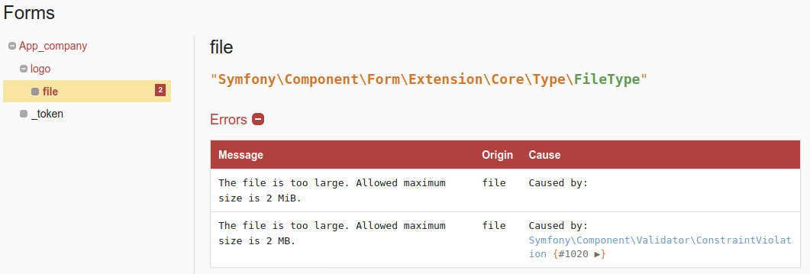
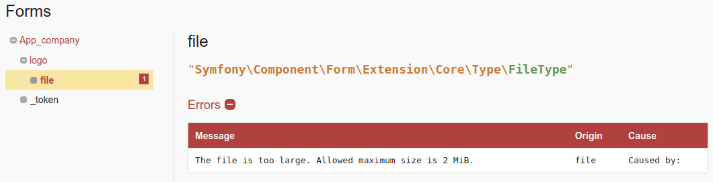

# Nested file entity size validation bug

## Steps to reproduce
Make sure you have `upload_max_filesize = 2M` in your `php.ini`.

Go to `localhost:8000/new` and submit an image larger than 2Mo.
Two errors should appear instead of one.

## Assumption
It's like the file size is validated prior to `@Assert\Image()` in `src/Entity/Logo.php` (maybe by the form itself or
indirectly through a caught exception?) then a second time by `@Assert\Image()`, this time properly overwritten by
`maxSize="2M"` (note the `[...] size is 2 MB` instead of `[...] size is 2 MiB`):

Note that if you remove `@Assert\Valid()` from `src/Entity/Company.php` only the first error is thrown:

(but `@Assert\Image()` is ignored so it is not a solution, you can confirm this by trying to submit a file other than
jpeg, you will not get an error)
